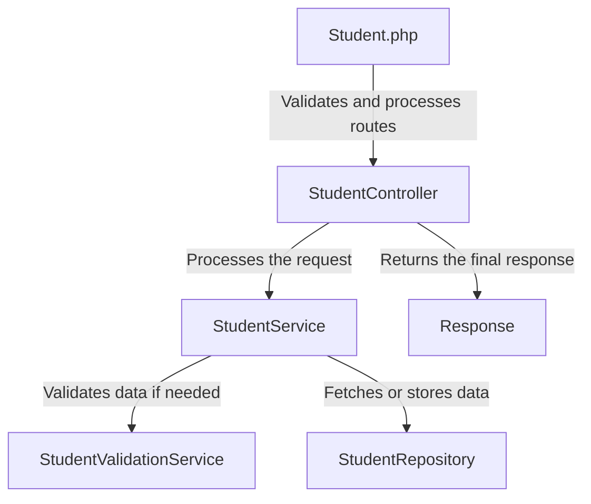

# Laravel API Boilerplate
A boilerplate for Laravel API projects complete with best practices and tools.

### Why?
I've picked several best practices after working with Laravel over the years. These usually are similar in most projects I build from scratch. This boilerplate is a starting point for new projects and aims to reduce the time spent on setting up the project.

This is highly opinionated and may not be suitable for all projects. This has served me well in the past and I hope it helps you too.

### What's included?
- Laravel Sail with Postgres, Minio and Redis
- Bugsnag
- PHPStan for static analysis
- PHPCS for code style
- Rector for code refactoring
- Sanctum for API tokens
- User authentication and registration endpoints
- Users roles
- Notes CRUD endpoints
- Services and repositories
- Lean JSON translations
- Tests

### How to use?
A typical endpoint consists of following elements. If you were to create new endpoint for students, you would need to create the following files:
- A separate routes file `students.php` under `routes/api-group` and include in `routes/api.php`
- `StudentController` Controller under `app/Http/Controllers/Api`
- `StudentService` under `app/Services`
- `StudentRepository` under `app/Repositories`
- One ore more request validation files under `app/Requests/Api` e.g `CreateStudentRequest`, `UpdateStudentRequest`
- Optionally a resource response under `app/Resources` e.g `StudentResource`

### Basic flow of request
If we consider the example of students, the flow of request would be as follows:

- **student.php**: Entry point to determine the appropriate route for processing.
- **StudentController**: Handles the request and delegates processing to StudentService.
- **StudentService**: Core logic layer; interacts with validation or data repository as needed.
- **StudentValidationService**: Performs validation if required.
- **StudentRepository**: Handles database interactions.
- **Response**: The final outcome is sent back from the StudentController.

### Some rules to follow
- Request validation should be in request files
- Logic validation should be in `{ServiceName}ValidationService` e.g `StudentValidationService`
- Main logic should be in `{ServiceName}Service` e.g `StudentService`
- Repositories should be called by services only
- Controllers should be thin and should only call services
- Exceptions are thrown in services and handled by controllers
- All database logic will stay in repositories. No eloquent calls are performed anywhere else.

### Helpful commands
Several make commands are included to make your life as developer easier. This includes logging into different containers, run code quality checks, performing tests, clearing caches and more. You can view them by running `make help`

Some of the most used commands are:
- `make login-laravel` - Login to Laravel container
- `make clear-cache` - Clear cache
- `make code` - Run code quality checks
- `make fix` - Fix code style issues
- `make test` - Run tests
